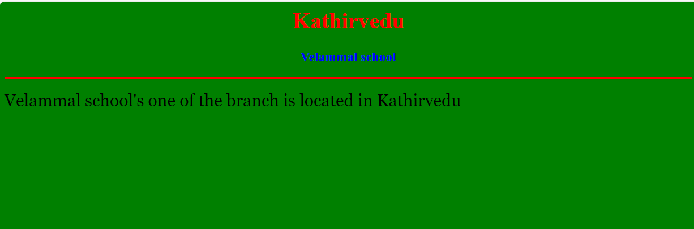

# Ex04 Places Around Me
## Date: 25.4.2024

## AIM
To develop a website to display details about the places around my house.

## DESIGN STEPS

### STEP 1
Create a Django admin interface.

### STEP 2
Download your city map from Google.

### STEP 3
Using ```<map>``` tag name the map.

### STEP 4
Create clickable regions in the image using ```<area>``` tag.

### STEP 5
Write HTML programs for all the regions identified.

### STEP 6
Execute the programs and publish them.

## CODE
```
map.html


<html>
    <head>
<title>My City</title>
    </head>
    <body>
<h1 align="center">
    <font color="red"><b>Kathirvedu</b></font>
</h1>
<h3 align="center">
    <font color="blue"><b>Divya R V (212223100005)</b></font>
</h3>
<center>
    
    <map name="MyCity">
        <area shape="rect" coords="1000,1000,1000,1000" href="home.html" title="My Home Town">
        <area shape="rect" coords="1000,1000,1000,1000" href="school.html" title="school">
        <area shape="rect" coords="1000,1000,1000,1000" href="college.html" title="college">
        <area shape="rect" coords="1000,1000,1000,1000" href="dam.html" title="dam">

    </map>
</center>
    </body>
</html>

home.html

<html>
    <head>
<title>My Home Town</title>
    </head>
    <body bgcolor="pink">
<h1 align="center">
    <font color="red"><b>Kathirvedu</b></font>
</h1>
<h3 align="center">
    <font color="blue"><b>The place Kathirvedu</b></font>
</h3>
<hr size="3"color="red">
<p align="justify">
    <font face="Georgia" size="5">
        Kathirvedu is located in the Thiruvallur district of Tamil Nadu.
    </font>

</p>
    </body>
</html>

lake.html

<html>
    <head>
<title>lake</title>
    </head>
    <body bgcolor="blue">
<h1 align="center">
    <font color="red"><b>Kathirvedu</b></font>
</h1>
<h3 align="center">
    <font color="blue"><b> puzhal lake</b></font>
</h3>
<hr size="3"color="red">
<p align="justify">
    <font face="Georgia" size="5">
      Kathirvedu village is located near the puzhal lake.
    </font> 

</p>
    </body>
</html>

school.html

<html>
    <head>
<title>School</title>
    </head>
    <body bgcolor="green">
<h1 align="center">
    <font color="red"><b>Kathirvedu</b></font>
</h1>
<h3 align="center">
    <font color="blue"><b>Velammal school</b></font>
</h3>
<hr size="3"color="red">
<p align="justify">
    <font face="Georgia" size="5">
       Velammal school's one of the branch is located in Kathirvedu
    </font>

</p>
    </body>
</html>

college.html

<html>
    <head>
<title>college</title>
    </head>
    <body bgcolor="yellow">
<h1 align="center">
    <font color="red"><b>Kathirvedu</b></font>
</h1>
<h3 align="center">
    <font color="blue"><b>Velammal college</b></font>
</h3>
<hr size="3"color="red">
<p align="justify">
    <font face="Georgia" size="5">
       Velammal Engineering college is located near Kathirvedu.
    </font>

</p>
    </body>
</html>

```

## OUTPUT





## RESULT
The program for implementing image maps using HTML is executed successfully.
